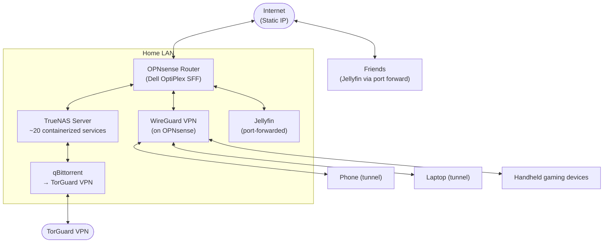

# Homelab

Personal home infrastructure: network, storage, media automation, and remote access — documented as code.

**Operator:** Pete
**Status:** Actively maintained
**Docs:** [`docs/`](docs/)

## Architecture

See [docs/network-architecture.md](docs/network-architecture.md) for the full breakdown.

## Services

| Category | Services |
|---|---|
| Media automation | Sonarr, Radarr, Jackett, FlareSolverr, qBittorrent, Jdownloader2, PlexRipper, MeTube |
| Media serving | Jellyfin, Jellystat, Seerr, Tunarr |
| Photos | Immich |
| Audiobooks | Audiobookshelf |
| Retro gaming | RomM |
| Dashboard / files | Homarr, Filebrowser |
| Monitoring | Scrutiny (drive health) |
| Stopped / experimental | Lidarr, Mealie, Netdata, OctoPrint, Kiwix, Manyfold, Crafty, FileFlows, Handbrake, MakeMKV, Gameyfin, ErsatzTV, Automatic Ripping Machine, Open WebUI |

## Project write-ups

Each one follows the same shape: **problem → design decisions → what broke → how I fixed it.**

- [Remote access with WireGuard on OPNsense](docs/remote-access-wireguard.md)
- [Media automation pipeline (*arr stack)](docs/media-automation-pipeline.md)
- [Sharing Jellyfin with friends over a static IP](docs/jellyfin-external-sharing.md)
- [Backup & replication strategy](docs/backup-and-replication.md) — includes the second TrueNAS build
- [Hardware inventory](docs/hardware-inventory.md)

## Configs

Sanitized, secrets-stripped service configs live in [`configs/`](configs/). Anything with a credential, API key, or public IP has been redacted — see the README in that folder.

---

*Hardware, network, and storage are documented. Remaining TODOs: spare-PC specs for the replication build, and more "what broke" war stories as they happen.*
