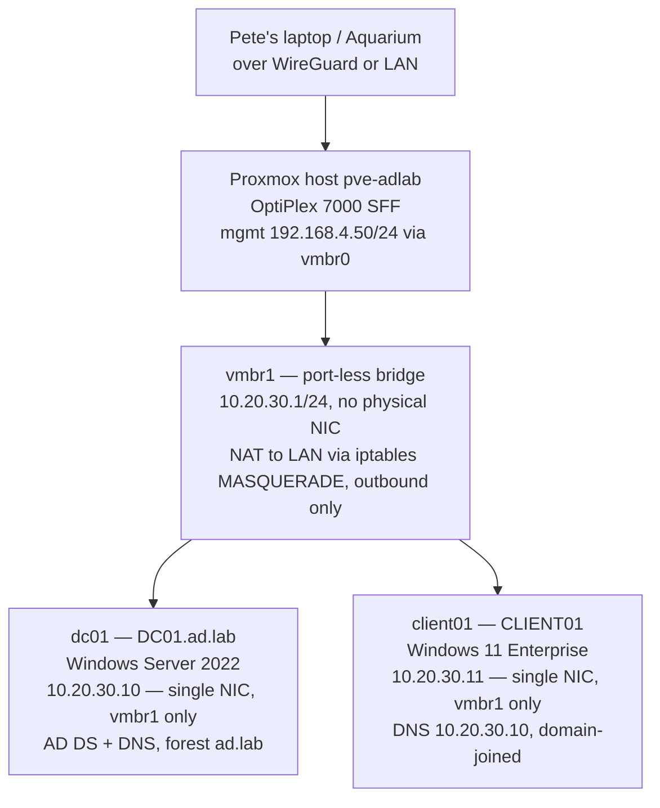

# AD lab network

> Built Friday Oct 9, 2026. IPs confirmed below.

**Why this shape:** the lab subnet is a world of its own. The DC is the
lab's DNS server, so client VMs resolve AD names without ever touching the
production LAN's DNS. NAT on the Proxmox host gives the VMs outbound access
for updates without exposing them inbound. If a GPO goes sideways, the
blast radius ends at the bridge.

## Why the lab can't leak onto the LAN

This is structural, not a promise. `vmbr1` is a Linux bridge with no
physical interface enslaved to it — a virtual switch that exists only
inside the Proxmox host. The DC gets a single NIC, attached to `vmbr1`
and nothing else. Its DHCP broadcasts, DNS queries, and AD traffic
physically cannot reach the production LAN: there is no wire to carry
them.

Outbound internet for the lab comes via NAT on the host. The lab VMs can
pull Windows updates while appearing to the OPNsense box as just the
Proxmox host's IP — nothing inbound. The failure mode to fear, a lab
DHCP server answering broadcasts on `192.168.4.0/24`, requires the DC to
have a NIC on `vmbr0`, the LAN bridge. It won't. The dangerous
configuration can't exist; it isn't merely avoided.

## Build-day verification — ran before and after the DC promo

- [x] `vmbr1` shows no enslaved physical interface — confirmed in the
  Proxmox UI (Ports/Slaves empty) and `bridge-ports none` in
  `/etc/network/interfaces`
- [x] On the DC, the single adapter is on `10.20.30.10`, gateway
  `10.20.30.1`, DNS `127.0.0.1` (itself); on the client,
  `10.20.30.11`, DNS `10.20.30.10` (the DC)
- [x] NAT verified: `iptables -t nat -L POSTROUTING` shows the
  MASQUERADE rule; the DC resolves internet names via its forwarders
- [x] Production LAN untouched: the lab bridge has no physical ports,
  and the DC was never attached to `vmbr0`

Initial Proxmox install is done with a monitor and keyboard attached
directly; afterward the host runs headless in its printed stand next to
the OPNsense box.
