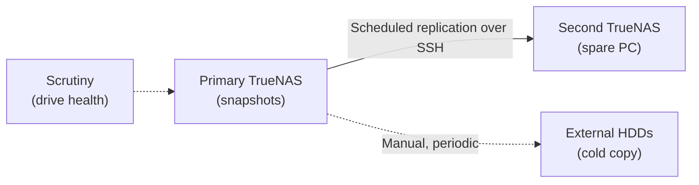

# Backup & replication strategy

## Current state

- Manual backups of the main media collection to external hard disks.
- Scrutiny monitors drive health on the primary TrueNAS box (early warning for failing disks).

Honest assessment: the manual HDD backups work, but they're not automated, not versioned, and not tested on a schedule. That's the gap this project closes.

## Why this project exists: the Pool2 scare

A drive in Pool2 (Storage — photos, documents, programs, game backups, the ROM collection) started throwing bad sectors, and TrueNAS alerted on it. That kicked off an immediate backup scramble. In the end only a single ROM was lost, and it was recovered onto a new drive. The failing drive was labeled BAD and retired to a shelf so it could never accidentally end up back in a pool.

The postmortem improvement: Scrutiny was installed for continuous drive-health monitoring, so the next failing drive gets caught by a dashboard instead of by panic.

Lesson: the alert worked and the backup worked — but it was luck as much as planning. A scheduled, automated replica removes the luck.

## The build: second TrueNAS replication target

Built October 2026 from a spare Dell OptiPlex 9020 mini tower:

1. **Assembled the box** — TrueNAS SCALE on the 9020: 256GB boot SSD, 2× 2TB HDDs in a stripe (~3.5TiB usable, no mirror — it's a replica, not primary storage).
2. **Snapshot schedule on primary** — daily snapshots, kept 2 weeks: `Pool1/Media` at midnight, `Pool2/Storage` at 1am (naming `auto-%Y-%m-%d_%H-%M`).
3. **Replication task** — TrueNAS → TrueNAS over the LAN via SSH+NETCAT, pushing both datasets to the `replica` pool on a schedule after the snapshots land.
4. **Restore test** — cloned a snapshot on the replica, recovered a file, `sha256sum` matched the primary exactly. An untested backup is a rumor; this one isn't.
5. **Cold HDD copy** — 4× 1TB + 7× 500GB drives on hand for the offline third copy (3-2-1: 3 copies, 2 media types, 1 offline). Refresh cadence TBD.

## Design decisions

| Decision | Rationale |
|---|---|
| TrueNAS replication vs. rsync | Block-level, incremental, preserves snapshots — and it's a marketable skill |
| Replica on LAN vs. off-site | LAN is what's available; honest about the trade-off (fire/flood risk remains) — cold HDDs mitigate |
| Snapshot retention: 2 weeks daily | Balance drive space against how far back you'd realistically need to go; media barely churns so snapshots stay cheap |

## Build log

- **2026-10-06**: assembled the 9020, created the `replica` pool, ran the seed (~2.9TB: 1.97T Media + ~960G Storage). Two setup gotchas worth remembering: Rufus ISO-mode boot failed (reflashed in DD mode), and the static IP needed an explicit netmask/gateway. Restore test passed same day — cloned snapshot, recovered `Work/job.txt`, checksums matched the primary. Details in the [replication runbook](replication-build-runbook.md).

## Still to do

- [ ] Decide cold-HDD refresh cadence
- [ ] Set up failure alerts (email/Discord) for the replication task
