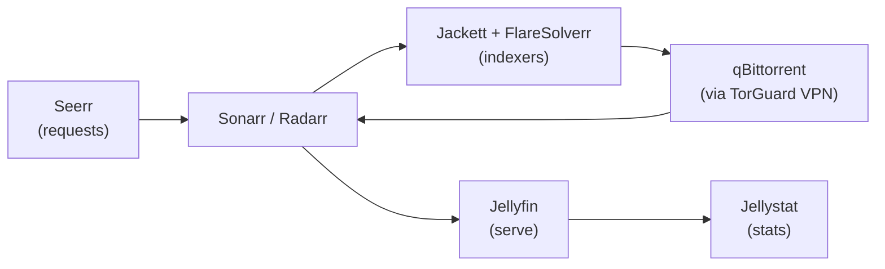

# Media automation pipeline (*arr stack)

## Problem

Wanted a self-running media library: request → find → download → organize → serve, with minimal manual intervention.

## The pipeline

- **Seerr**: friends and family request movies/shows through a simple UI.
- **Sonarr/Radarr**: track wanted content, talk to indexers, hand off to the downloader, then rename and file everything into the library.
- **Jackett + FlareSolverr**: aggregate torrent indexers; FlareSolverr solves the Cloudflare challenges that would otherwise block indexer queries.
- **qBittorrent**: downloads, bound to the TorGuard VPN interface.
- **Jellyfin**: serves the finished library; **Jellystat** tracks watch stats; **Tunarr** builds live-TV channels from the library.

Supporting cast: Jdownloader2 and PlexRipper for one-off grabs, MeTube for YouTube downloads, Audiobookshelf for audiobooks, RomM for retro games, Immich for photo backup.

## Design decisions

| Decision | Why |
|---|---|
| Split download vs. serve | The *arr apps manage files; Jellyfin only reads the finished library — a failed download never corrupts what's being watched |
| FlareSolverr alongside Jackett | Indexers behind Cloudflare silently fail without a solver; this was (TODO: confirm) the fix for mysteriously empty search results |
| VPN-bound torrent client | Privacy and ISP-complaint avoidance; traffic dies instead of leaking if the tunnel drops |

## What broke / lessons learned

TODO: add 2–3 real war stories. Strong candidates:
- FlareSolverr/Cloudflare issues
- Jackett indexer going down and re-adding it
- Permissions/ownership fights between containers and TrueNAS datasets (the classic one)
- A Sonarr/Radarr misconfiguration that downloaded the wrong thing

## TODO

- [ ] Sanitized docker-compose / TrueNAS app configs → `configs/`
- [ ] Dataset layout (where downloads land vs. where the library lives)
- [ ] Note which services are exposed to friends vs. LAN-only
