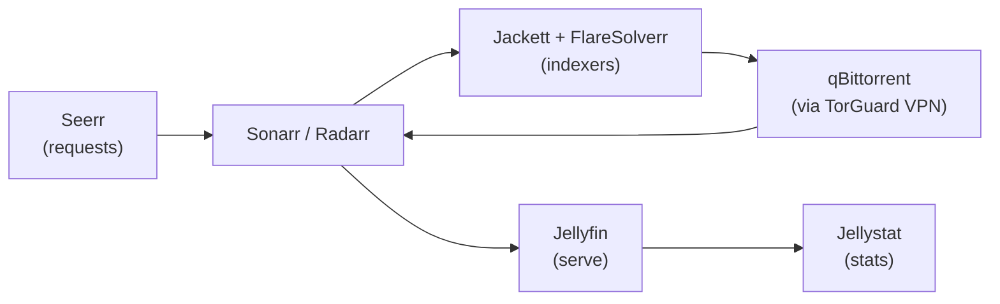

# Media automation pipeline (*arr stack)

## Problem

Wanted a self-running media library: request → find → download → organize → serve, with minimal manual intervention.

## The pipeline

- **Seerr**: friends and family request movies/shows through a simple UI.
- **Sonarr/Radarr**: track wanted content, talk to indexers, hand off to the downloader, then rename and file everything into the library.
- **Jackett + FlareSolverr**: aggregate torrent indexers; FlareSolverr solves the Cloudflare challenges that would otherwise block indexer queries.
- **qBittorrent**: downloads, bound to the TorGuard VPN interface.
- **Jellyfin**: serves the finished library; **Jellystat** tracks watch stats; **Tunarr** builds live-TV channels from the library.

Supporting cast: Jdownloader2 and PlexRipper for one-off grabs, MeTube for YouTube downloads, Audiobookshelf for audiobooks, RomM for retro games, Immich for photo backup.

## Storage layout

The pipeline is split across pools by speed tier:

| Pool | Holds | Why |
|---|---|---|
| AppsNVME (NVMe) | All app configs and working data (Handbrake, makemkv, Minecraft, spoolman datasets live here) | Containers do lots of small I/O; NVMe keeps them snappy |
| NVMEStorage (NVMe) | Reworks staging | Fast scratch space |
| Pool1 (HDD) | `Media` dataset — the finished library Jellyfin serves | Bulk sequential reads; HDDs are fine and cheap per TB |
| Pool2 (HDD) | `Storage` dataset — general storage | Bulk storage |

Downloads land on fast storage, the *arr apps process and rename, and the finished library lives on the HDD pools. Jellyfin only ever reads the finished library — a failed download never corrupts what's being watched.

## Design decisions

| Decision | Why |
|---|---|
| Split download vs. serve | The *arr apps manage files; Jellyfin only reads the finished library — a failed download never corrupts what's being watched |
| FlareSolverr alongside Jackett | Indexers behind Cloudflare silently fail without a solver; this was (TODO: confirm) the fix for mysteriously empty search results |
| VPN-bound torrent client | Privacy and ISP-complaint avoidance; traffic dies instead of leaking if the tunnel drops |

## What broke / lessons learned

**RomM's bad update.** A RomM update shipped with bugs that crashed the instance. Rather than debugging someone else's broken release at midnight, I rolled back to the previous working version and waited for the next weekly update, which fixed it. Lesson: with apps that update weekly, the rollback button is a feature — pin what works, and let the upstream fix their regression.

**250 GB of stale Docker images.** The apps NVMe pool started running low on space. Investigation showed over 250 GB of old, unused Docker images had accumulated from months of app updates. Ran an image prune from the TrueNAS shell — with the critical precaution of making sure every app was *running* first, so the prune couldn't delete the image behind a live container. Reclaimed the space with zero downtime. Lesson: container updates don't clean up after themselves; image hygiene is a recurring ops task, not a one-time fix.

TODO: more stories as they happen — FlareSolverr/Cloudflare fights, Jackett indexer outages, container-vs-dataset permission battles.

## TODO

- [ ] Sanitized docker-compose / TrueNAS app configs → `configs/`
- [ ] Dataset layout (where downloads land vs. where the library lives)
- [ ] Note which services are exposed to friends vs. LAN-only
