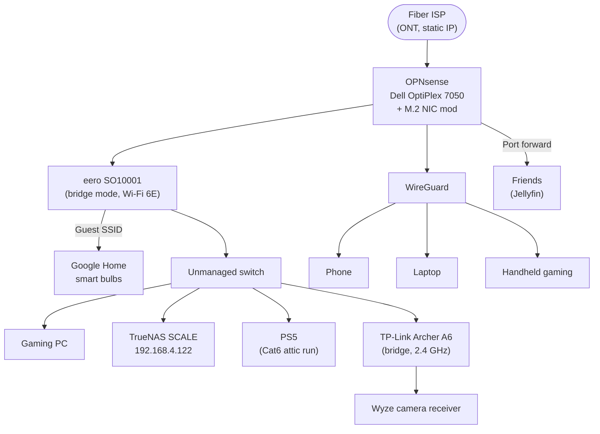

# Network architecture

## Overview

Fiber ONT → OPNsense on a Dell OptiPlex 7050 → eero (bridge mode) → unmanaged switch → everything else. Flat 192.168.4.0/24 network, no VLANs.

Remote access is handled by **WireGuard running directly on OPNsense** — no publicly exposed reverse proxy, which keeps the attack surface to one UDP port. Friends access Jellyfin through a single OPNsense port forward.

## Physical topology

## Design decisions

| Decision | Why |
|---|---|
| WireGuard on the router instead of a reverse proxy | Smaller attack surface; no public web dashboard to harden; native OPNsense support with per-peer config |
| Static IP from ISP | Stable endpoint for WireGuard peers and the Jellyfin port forward; no DDNS moving parts |
| qBittorrent via SOCKS5 proxy | Download traffic is proxied through the VPN provider; if the proxy is unreachable, transfers fail closed instead of leaking onto the home IP |
| Single Jellyfin port forward | Pragmatic sharing for a handful of friends; one TCP port, not a whole dashboard |
| eero + Archer A6 both in bridge mode | OPNsense stays the single router/DHCP server; APs are just radios, no double NAT |
| Guest SSID for smart-home gear | Google Home and bulbs isolated from the main WLAN at the Wi-Fi layer |
| Flat network, no VLANs (yet) | Simplicity won; segmentation is a known future improvement |
| OPNsense admin never on WAN | Admin UI is reachable only from the LAN or over WireGuard |

## The M.2 NIC mod

The OptiPlex 7050 needed a second NIC for the router build. Instead of a USB adapter, an extra NIC was added through a **spare M.2 slot**, with a **custom-designed 3D-printed housing** to mount it to the case — modeled and published here: [M.2 NIC mount on MakerWorld](https://makerworld.com/models/1879026?appSharePlatform=copy). Proper PCIe networking on a machine that was never meant to be a router.

## Power

Everything network-critical — OPNsense box, TrueNAS, switch, both Wi-Fi routers — sits on a Tripp Lite UPS.

## What broke / lessons learned

TODO: add stories as they happen. Candidates:
- Jellyfin buffering for a remote friend (transcode settings? upload bandwidth cap?)
- qBittorrent behavior when the VPN tunnel drops

## Future improvements

- [ ] VLANs: separate IoT / guest / trusted LAN at the switch level instead of just Wi-Fi SSIDs
