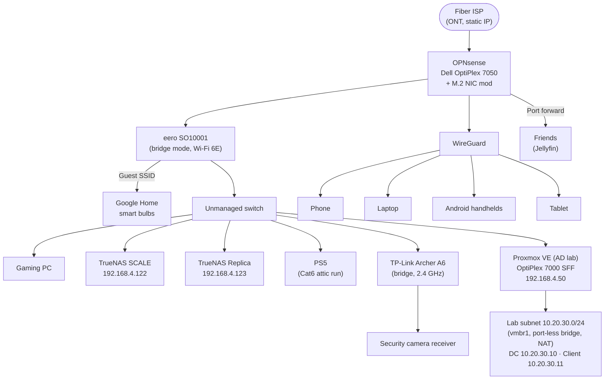

# Network architecture

## Overview

Fiber ONT → OPNsense on a Dell OptiPlex 7050 → eero (bridge mode) → unmanaged switch → everything else. Flat 192.168.4.0/24 network, no VLANs.

Remote access is handled by **WireGuard running directly on OPNsense** — no publicly exposed reverse proxy, which keeps the attack surface to one UDP port. Friends access Jellyfin through a single OPNsense port forward.

## Physical topology

## Design decisions

| Decision | Why |
|---|---|
| WireGuard on the router instead of a reverse proxy | Smaller attack surface; no public web dashboard to harden; native OPNsense support with per-peer config |
| Static IP from ISP | Stable endpoint for WireGuard peers and the Jellyfin port forward; no DDNS moving parts |
| qBittorrent via SOCKS5 proxy | Download traffic is proxied through the VPN provider; the client is configured so transfers fail closed instead of leaking onto the home IP if the proxy is unreachable |
| Single Jellyfin port forward | Pragmatic sharing for a handful of friends; one TCP port, not a whole dashboard |
| eero + Archer A6 both in bridge mode | OPNsense stays the single router/DHCP server; APs are just radios, no double NAT |
| Guest SSID for smart-home gear | Google Home and bulbs isolated from the main WLAN at the Wi-Fi layer |
| Flat network, no VLANs (yet) | Simplicity won; segmentation is a known future improvement |
| OPNsense admin never on WAN | Admin UI is reachable only from the LAN or over WireGuard |
| Port-less bridge + NAT for the lab subnet | Lab DHCP/DNS can never leak onto the production LAN — the isolation is structural (no wire to carry it), not a firewall rule to get wrong |

## AD lab subnet

The Proxmox host (`pve-adlab`, Dell OptiPlex 7000 SFF, `192.168.4.50`)
sits on the LAN like any other device, but the lab itself lives on an
isolated virtual subnet:

- `vmbr1` is a Linux bridge with **no physical interface attached** — a
  virtual switch that exists only inside the Proxmox host.
- The lab subnet is `10.20.30.0/24`; the host is `.1` and NATs lab
  traffic outbound with an iptables MASQUERADE rule, so VMs get
  internet for updates without being reachable inbound.
- The domain controller (`DC01`, `10.20.30.10`) and the Windows 11
  client (`CLIENT01`, `10.20.30.11`) each have a single NIC on `vmbr1`.
  Their DHCP broadcasts, DNS, and AD traffic physically cannot reach
  the production LAN.

Full write-up: [Active Directory test lab](ad-lab/).

## The M.2 NIC mod

The OptiPlex 7050 needed a second NIC for the router build. Instead of a USB adapter, an extra NIC was added through a **spare M.2 slot**, with a **custom 3D-printed housing** to mount it to the case — modeled and published here: [M.2 NIC mount on MakerWorld](https://makerworld.com/models/1879026?appSharePlatform=copy). Proper PCIe networking on a machine that was never meant to be a router.

## Game streaming over WireGuard

- **Apollo** (a Sunshine fork) runs on the gaming PC; **Moonlight** runs on the WireGuard-connected devices (phone, Android handhelds, tablet, laptop).
- Streams games remotely with **zero open ports** — all traffic rides the existing WireGuard tunnel.
- The gaming PC has **Wake-on-LAN enabled**; the magic packet is sent from OPNsense itself, reached over the WireGuard connection. Full loop: connect VPN → wake PC → stream games, from anywhere.

| Decision | Why |
|---|---|
| Streaming over the VPN tunnel instead of port forwarding | No exposed streaming ports; authentication and encryption come free with WireGuard |
| WoL via OPNsense | The router is always on and already reachable remotely — the natural place to send the wake packet from |

## Power

Everything network-critical — OPNsense box, TrueNAS, switch, both Wi-Fi routers — sits on a Tripp Lite UPS.

## What broke / lessons learned

**Replica invisible to WireGuard: the gateway that never took effect.** The new TrueNAS replica (`.123`) worked fine on the LAN and replication ran clean — but WireGuard clients couldn't reach it at all. `ip route` showed no default route: the gateway from the static-IP setup had never actually applied. Same-subnet traffic never needs a gateway, so nothing noticed until a cross-subnet client tried to connect. Fixed by setting the gateway (and DNS) properly in the TrueNAS UI — and now `ip route` is part of verifying any static config, not just the UI form. Full write-up in [war stories](war-stories.md).

Other candidates for future entries: Jellyfin buffering for a remote friend (transcode settings? upload bandwidth cap?), qBittorrent behavior when the VPN tunnel drops.

## Future improvements

- [ ] VLANs: separate IoT / guest / trusted LAN at the switch level instead of just Wi-Fi SSIDs
